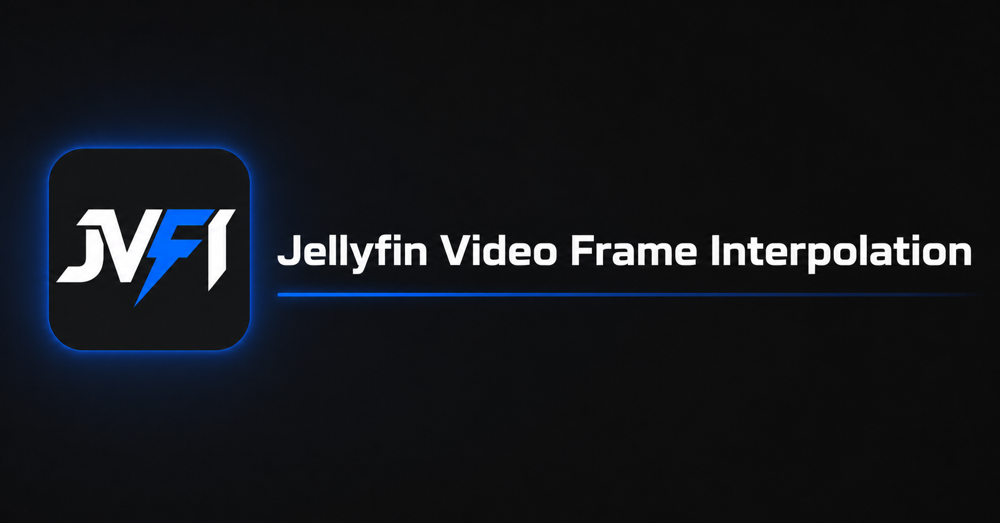

<p align="center">
  
</p>

# Jellyfin Video Frame Interpolation (JVFI)

[繁體中文](README.md) | [简体中文](README.zh-CN.md) | **English**

JVFI is a server-side real-time frame interpolation plugin for Jellyfin. It provides the existing configurable target-frame-rate mode and an optional **Smooth effect — source FPS X2** mode on qualified hardware. Jellyfin Web, Jellyfin Media Player, Android, and Android TV clients do not require a separate extension.

## Features

- Configurable `23.976–240 FPS` target output, with 60 FPS as the default
- Optional **Smooth effect — source FPS X2** mode; disabling it keeps the original interpolation path
- Preserves the source resolution by default instead of forcing 480p or 1080p
- Supports Jellyfin Web, Jellyfin Media Player, Android, Android TV, and compatible clients
- Uses the official `jellyfin-ffmpeg` binary without replacing FFmpeg
- Probes actual decoder, processing, and encoder capabilities before selecting a path
- Hardware and interpolation pipeline display follows Jellyfin's actual hardware acceleration settings
- Detects common Intel QSV / VAAPI, AMD VAAPI / AMF, NVIDIA NVENC, Rockchip RKMPP, and Apple VideoToolbox paths
- Falls back to a compatible path when hardware processing is unavailable and preserves normal Jellyfin playback when interpolation cannot run safely
- Bundles the private smooth runtime with the plugin; it is used only by self-tested JVFI transcodes and never replaces Jellyfin's global FFmpeg installation
- Optional playback HUD for interpolation status, timeline FPS, compute throughput, and pipeline speed
- Separate minimum bitrate controls for 480p, 720p, 1080p, 1440p, and 4K output
- Traditional Chinese, English, and Japanese settings UI

## Install from the Jellyfin catalog

Add a repository under `Dashboard` → `Plugins` → `Repositories`:

- Name: `JVFI`
- Repository URL:

```text
https://skillgodak.github.io/JVFI/manifest.json
```

Return to the plugin catalog, search for `JVFI`, install **JVFI**, and fully restart Jellyfin.

## Manual installation

Download the ZIP from [GitHub Releases](https://github.com/SkillGodAk/JVFI/releases) and extract it to:

```text
jellyfin/config/plugins/Jellyfin Video Frame Interpolation/
```

Docker example:

```text
/volume1/docker/jellyfin/config/plugins/Jellyfin Video Frame Interpolation/
```

Fully restart Jellyfin to load the plugin.

## Supported environments

| Item | Status |
|---|---|
| Jellyfin 10.11.11 | Current minimum installation version and primary validated release |
| Linux ARM64 / RK3588 | Current primary validation platform |
| Jellyfin Web | Standard transcoded stream supported |
| Jellyfin Media Player | Standard transcoded stream supported |
| Android / Android TV | Standard transcoded stream supported |
| Other hardware and newer Jellyfin versions | Enabled according to runtime capability checks |

Smooth X2 in version 0.7.7 is limited to Linux ARM64 and Linux x64. Windows and macOS retain the original interpolation path, while Smooth safely falls back to it. Windows Smooth support is deferred to version 0.7.8 after real-hardware validation.

Only Rockchip RK3588/RK3588S on Linux ARM64 has completed real-device validation for JVFI Smooth effect. The Linux models below are experimental candidates with relevant decode, OpenCL compute, and hardware-encode capabilities. They are not confirmed compatible; activation and real-time performance depend on the complete self-test on each host.

- Linux ARM64/Rockchip: RK3576 (slower than RK3588; real-time 4K performance remains unverified)
- Linux x64/Intel: N95, N100, N150, N200, N250, Core i3-N300, Core i3-N305, Core 3 N350, Core 3 N355, Core i5-11400, Pentium Gold G7400, Arc A380/A580/A750/A770/B570/B580
- Linux x64/AMD: Radeon RX 6600/6600 XT/6700/6800/6900 series, RX 7700 XT/7800 XT/7900 series, RX 9060/9070 series, Radeon Pro W6800/W7700/W7800/W7900
- Linux x64/NVIDIA: GeForce GTX 1650/1660 series, RTX 20/30/40/50 series, T4, RTX A2000/A4000/A5000/A6000

On Linux, the N100 and N150 provide the Intel Quick Sync, OpenCL, and media-driver prerequisites, making them promising low-power experimental candidates. They have not yet been tested on real hardware with JVFI, so real-time 1080p or 4K performance is not guaranteed. Other ARM SoCs are not listed because version 0.7.7 does not yet include their hardware adapters.

## Smooth X2 scope

Smooth effect always outputs source FPS X2. Version 0.7.7 is limited to Linux ARM64 and Linux x64, with a recognized resolution range up to and including 4K. Windows, macOS, other resolutions, HDR/HLG/Dolby Vision, failed self-tests, and incompatible hardware paths safely fall back to the original interpolation path without blocking Jellyfin playback.

## Support the author

If JVFI is useful to you, support for the author is welcome.

### International Support

<a href="https://buymeacoffee.com/SkillGodAK"></a>

### Bank transfer


### WeChat Pay


JVFI is an independent third-party project and is not affiliated with the Jellyfin project.
